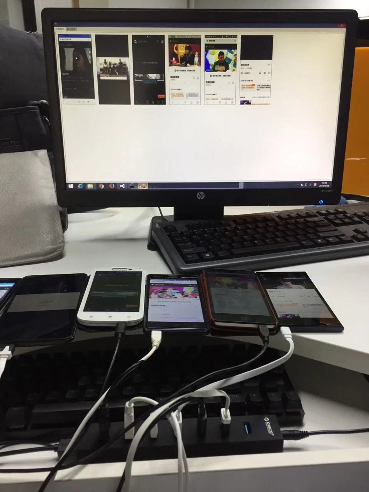
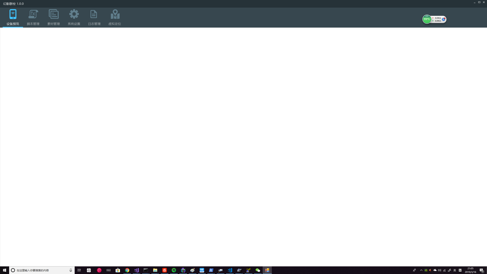
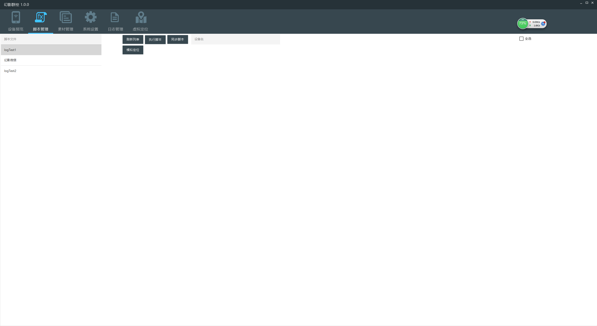
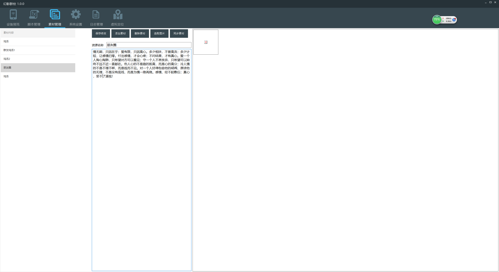
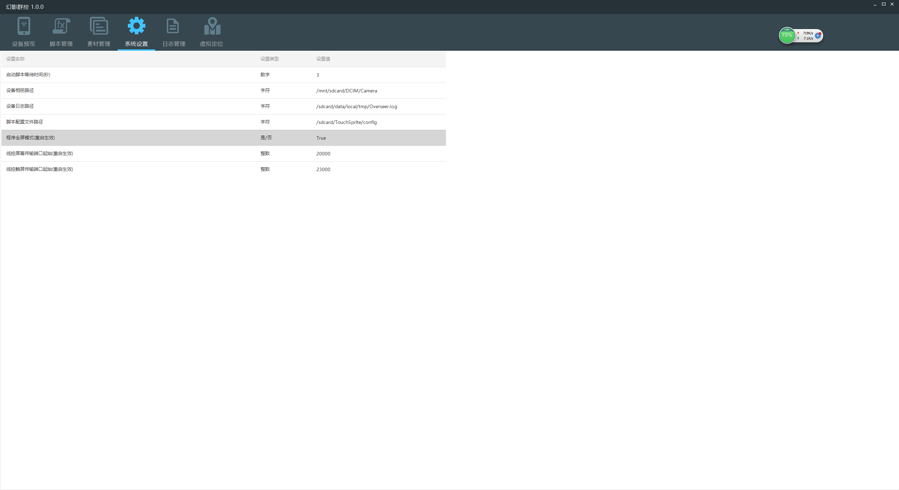
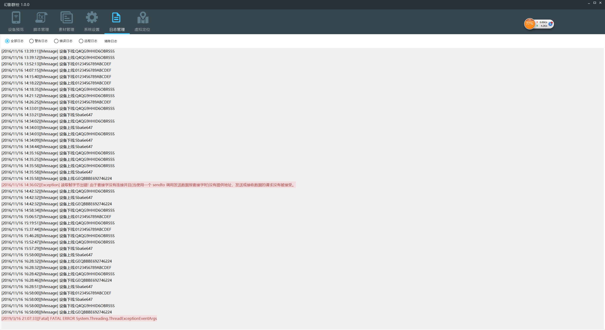

# 幻影群控

使用adb和minicap，minitouch进行android群控操作，受控端脚本使用触动精灵 （最好放弃改用上位机自行实现脚本化控制）

minicap使用mjpeg流占用大量带宽，只能同时操作15台左右机器 （最好放弃mjpeg改用视频流）

## 功能

能实现批量群控，批量预览，选设备单控，实时串流屏幕图片，批量执行脚本，批量同步素材等功能。 机器码账号授权 （服务器已不可用， 可自行移除UAC代码使用）

# 截圖

